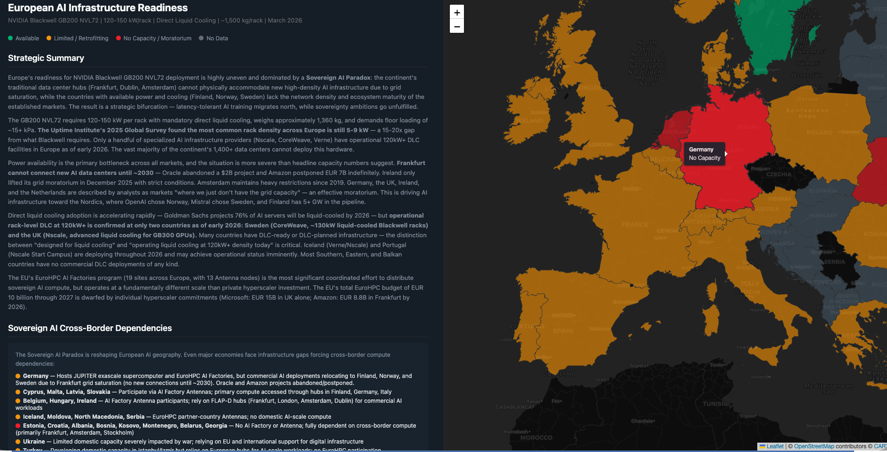

# Regional-AI

This project provides a base prompt to run in Claude. We recommend using its latest deep research model and enabling Claude to do live search during its execution. The prompt builds a lightweight HTML dashboard and visualization which analyzes which countries in a particular region have the suitable data center capacity to to deploy a particular AI Accelerator given its requirements (power, cooling, load weight, etc.) 
The first example explores NVIDIA Blackwell in Europe. The dashboard.html is the build of the prompt. You can download it and run it directly in the browser to access the visualization.
